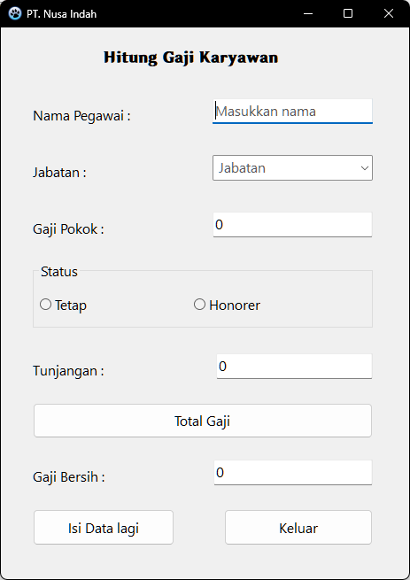
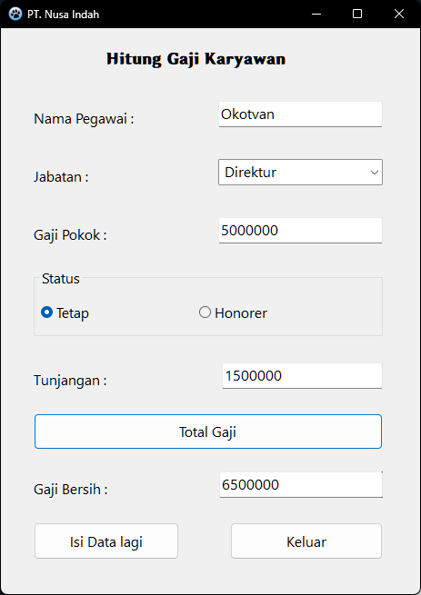
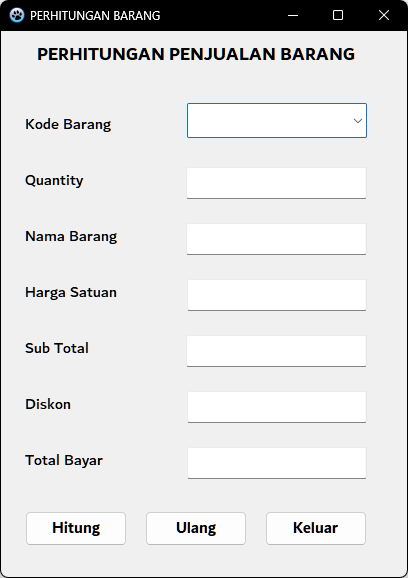
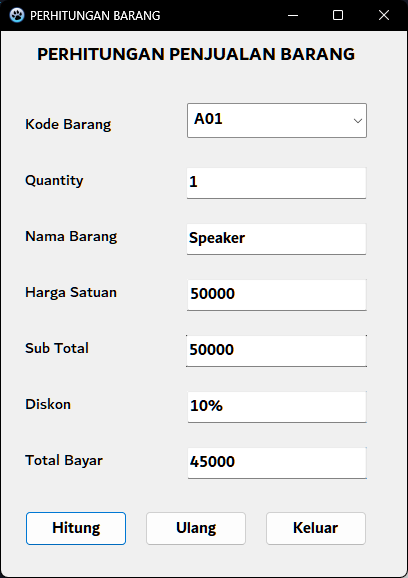
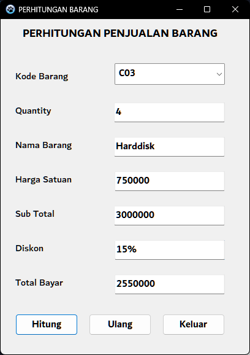

| Nama        | Oktovan Agung Shailendra      |
| ----------- | ----------------------------- |
| NIM         | 312010131                     |
| Kelas       | TI.20.A.RPL-1                 |
| Mata Kuliah | Pemrograman Visual            |
| Dosen       | Agung Nugroho, S.Kom., M.Kom. |

# Latihan 2 Pemrograman Visual

## 1. Program Menghitung Gaji Karyawan

- Tampilan Utama
  

- Tampilan Program
  

- tampilan Program
  

## 2. Program Penjualan barang

- Tampilan Utama
  

- Tampilan Program
  

- Tampilan Program
  
