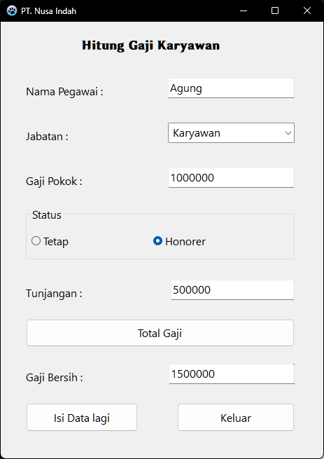

| Nama        | Oktovan Agung Shailendra      |
| ----------- | ----------------------------- |
| NIM         | 312010131                     |
| Kelas       | TI.20.A.RPL-1                 |
| Mata Kuliah | Pemrograman Visual            |
| Dosen       | Agung Nugroho, S.Kom., M.Kom. |

# Latihan 2 Pemrograman Visual

## 1. Program Menghitung Gaji Karyawan

- Tampilan Utama 
  

- Tampilan Program 
  

- Tampilan Program 
  

Untuk kode porgram sudah tertera pada folder **[1. Program Menghitung Gaji Karyawan](https://github.com/OktovanAgung/Latihan-2-Pemrograman-Visual/tree/main/1.%20Program%20Menghitung%20Gaji%20Karyawan)**

## 2. Program Penjualan barang

- Tampilan Utama 
  

- Tampilan Program 
  

- Tampilan Program 
  

Untuk kode porgram sudah tertera pada folder **[2. Program Penjualan Barang](https://github.com/OktovanAgung/Latihan-2-Pemrograman-Visual/tree/main/2.%20Program%20Penjualan%20Barang)**
